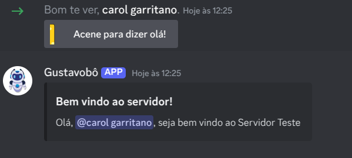
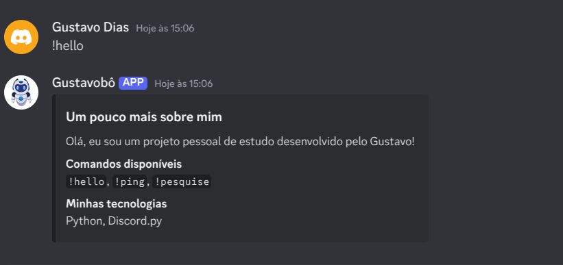
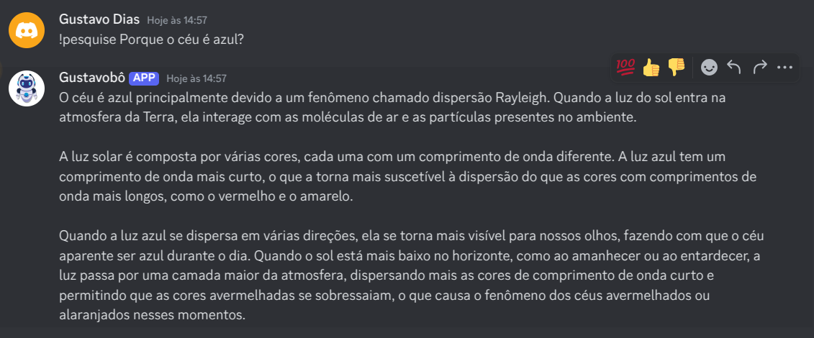

<h1>Gustavobô - o bot auxiliar do Discord</h1>

<p align="center">
  
  
</p>

## Descrição do projeto

<p align="justify">
  Bot de discord com integração da API da OpenAi para efetuar pesquisas, saudar novos membros e ver a latência do servidor.
</p>

## Layout da Aplicação:

### Saudando novos membros


### Explicando mais sobre o Gustavobô


### Template de banner para anunciar produtos


### Pesquisando com auxílio da OpenAI



## Como rodar a aplicação:

No terminal, clone o projeto:

```
git clone https://github.com/dias-gxstavo/bot-discord.git
```

Crie um arquivo .env para armazenar o TOKEN do seu bot e insira a env:

```
DISCORD_TOKEN='SEU_TOKEN'
```

Passe uma variável de ambiente com a chave da API da OpenAI
```
export OPENAI_API_KEY='SUA_KEY' (Linux/Mac) ou
setx OPENAI_API_KEY 'sua_key' (Windows)
```

## Como rodar os testes

```
python main.py
```

## Linguagens, dependencias e libs utilizadas 📚

- [Python](https://docs.python.org/3/)
- [Discord.py](https://discordpy.readthedocs.io/en/stable/)
- [OpenAi](https://platform.openai.com/docs/api-reference)


